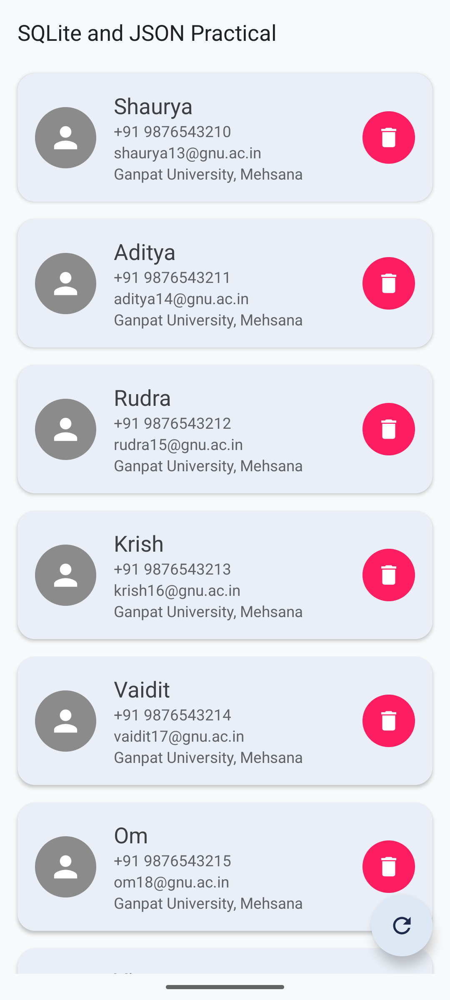
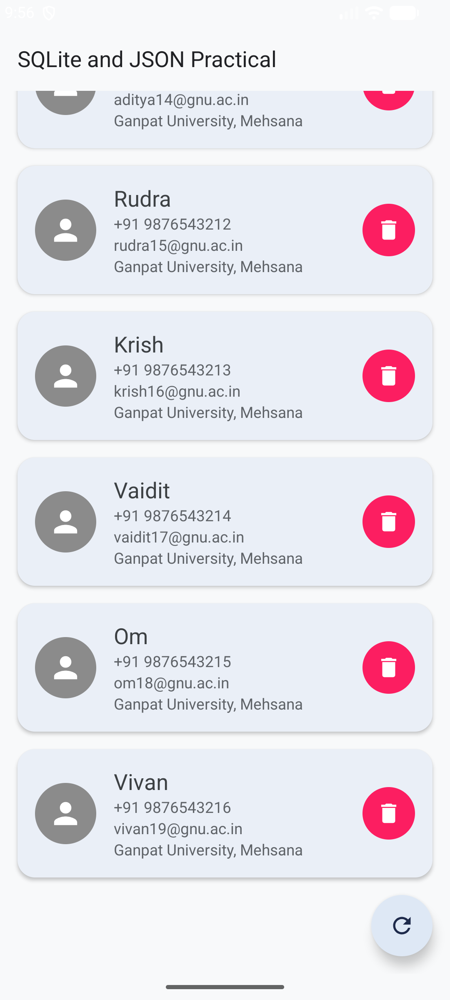

# MAD Practical 7

## Project Title

**SQLite and JSON Practical**

## Student Information

- **Enrollment No.:** 24012011128
- **Name:** Shaurya Patel
- **Course:** Mobile Application Development

## Description

This Android application demonstrates working with a local SQLite database and displaying person records in a RecyclerView. The application stores person details such as name, email, phone number, and address.

The application also contains an HTTP request class for making GET requests and handling a response as text.

## Features

- Display person records in a RecyclerView
- Store person details using SQLite
- Insert person records into the database
- Delete individual person records
- Delete and recreate the default person list using the refresh button
- Display name, phone number, email, and address
- Material CardView based user interface
- HTTP GET request support

## Technologies Used

- Kotlin
- Android Studio
- XML
- SQLite
- RecyclerView
- View Binding
- Material Components
- ConstraintLayout
- Android SDK

## Application Structure

```text
app/
├── src/
│   └── main/
│       ├── java/
│       │   └── com/example/a24012011128_mad_practical_7/
│       │       ├── DatabaseHelper.kt
│       │       ├── HttpRequest.kt
│       │       ├── MainActivity.kt
│       │       ├── Person.kt
│       │       ├── PersonAdapter.kt
│       │       └── PersonDbTableData.kt
│       └── res/
│           ├── drawable/
│           ├── layout/
│           │   ├── activity_main.xml
│           │   ├── item_person.xml
│           │   └── single_item.xml
│           ├── mipmap/
│           ├── values/
│           └── xml/
└── build.gradle.kts
```

## Database

The application uses SQLite with the database name:

```text
persons_db
```

The database contains a `persons` table with the following fields:

| Field | Description |
|---|---|
| id | Unique person ID |
| name | Person name |
| email | Email address |
| phone | Phone number |
| address | Home address |

## Main Components

### MainActivity

Handles the main screen, initializes the database and RecyclerView, loads person records, and refreshes the default data.

### DatabaseHelper

Handles SQLite database operations including:

- Creating the database table
- Inserting records
- Reading all records
- Deleting a person
- Deleting all records
- Database upgrades

### Person

Data model class used to represent a person.

### PersonAdapter

RecyclerView adapter used to display person information and handle delete operations.

### HttpRequest

Provides HTTP GET request functionality using `HttpURLConnection`.

#Screenshots

|  |  |  |
| :---: | :---: | :---: |
|  |  |

---

## How to Run

1. Open the project in Android Studio.
2. Let Gradle sync complete.
3. Connect an Android device or start an emulator.
4. Run the application.
5. The person list will be displayed on the main screen.
6. Use the delete button on a card to remove a person.
7. Use the refresh button to recreate the default person list.

## Default Records

The application initially loads seven person records:

- Shaurya
- Aditya
- Rudra
- Krish
- Vaidit
- Om
- Vivan

## Project Information

- **Practical:** 7
- **Enrollment No.:** 24012011128
- **Application ID:** `com.example.a24012011128_mad_practical_7`
- **Version:** 1.0
